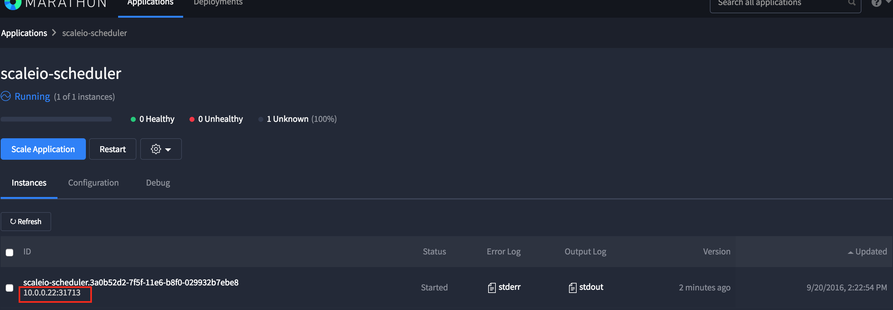
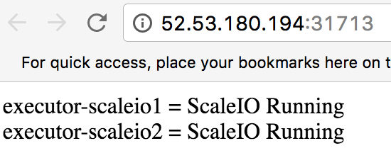

# Demo/Test the ScaleIO Framework for Apache Mesos

The requirements of having a 3-Node ScaleIO cluster along with an Apache Mesos Master and Agent cluster would heavily resource constrain a laptop or computer used for local development. An [AWS CloudFormation template](Framework_Testing_Cluster_Ubuntu.json) is provided that deploys and installs a fully configured Dell EMC ScaleIO and Apache Mesos cluster on Amazon AWS. This template currently works in the **US-West-1 (aka N.California) region only**.

*NOTE: Deploying this template uses six (6) `t2.medium` instances in the N.California region, costing $0.068/hour. The AWS EC2 compute usage for this cluster will cost approximately $9.78/day. The template provisions nine (9) EBS volumes in total. Six (6) for the operating systems and three (3) 100-gigabyte volumes for ScaleIO storage.*

Steps:

1. [Deploy The CloudFormation Template](#deploy-cloudformation-template)
2. [Verify ScaleIO Configuration](#verify-scaleio-configuration)
3. [Launch Framework](#launch-framework)
4. [Deploy Applications](#deploy-applications)

Watch the [YouTube Demo Video](https://youtu.be/tt6qhEkeVOQ?list=PLbssOJyyvHuWiBQAg9EFWH570timj2fxt) to see it in action.

## Deploy CloudFormation Template

The password for administrator rights is `F00barbaz`. The ScaleIO nodes are deployed using Redhat 7.X instances and the Mesos nodes are Ubuntu 14.04 instances. The usernames used to log into those systems via ssh are `ec2-user` and `ubuntu`, respectively.

Within the AWS Web GUI:

1. Verify you are in the N. California region.
2. Within the drop-down of `Services` choose `CloudFormation`
3. Click `Create Stack`, then `Choose a Template`
4. Click `Upload file to S3`, and upload [Framework_Testing_Cluster_Ubuntu.json](Framework_Testing_Cluster_Ubuntu.json)
5. Give the stack a unique name (such as: MesosFrameworkDemo)
6. Select a keypair that exists in the **N.California region**
7. Click `next`. Tags are optional. Click `next`
8. Review the settings and click `Create` to create the stack

The stack will take approximately two minutes to build and the nodes will be available for ssh login.

## Verify ScaleIO Configuration

It is important to determine the Master, Slave and TieBreaker MDM (Metadata Manager) nodes, as this information is needed to launch the framework. Through multiple testing scenarios, ScaleIONode2 (with the Private IP address of 10.0.0.12) is typically the Primary MDM node. SSH into that instance using the Public DNS or IP

```
ssh -i "keypair.pem" ec2-user@ScaleIONode2-IP-or-DNS
```

Run the following commands:

1. Log into the ScaleIO shell:
    ```
scli --login --username admin --password F00barbaz
    ```

2. Verify the MDM nodes:
    ```
scli --query_cluster
    ```

Sample output will look like this:
```
Cluster:
    Mode: 3_node, State: Normal, Active: 3/3, Replicas: 2/2
Master MDM:
    Name: Manager2, ID: 0x1ed68652078a0ab1
        IPs: 10.0.0.12, Management IPs: 10.0.0.12, Port: 9011
        Version: 2.0.5014
Slave MDMs:
    Name: Manager1, ID: 0x44691e69695396d0
        IPs: 10.0.0.11, Management IPs: 10.0.0.11, Port: 9011
        Status: Normal, Version: 2.0.5014
Tie-Breakers:
    Name: Tie-Breaker1, ID: 0x569bc3812558b2d2
        IPs: 10.0.0.13, Port: 9011
        Status: Normal, Version: 2.0.5014
```

## Launch Framework

Before launching, open the Marathon UI at:
```
http://[MESOS MASTER PUBLIC DNS/IP ADDRESS]:8080
```

Utilize [scaleio.json](scaleio.json) to correctly match and/or update the internal IP addresses of the Master, Slave, and TieBreaker MDM nodes. Typically, but not always, the defaults are the correct values:

```
{
  "id": "scaleio-scheduler",
  "uris": [
    "https://github.com/codedellemc/scaleio-framework/releases/download/v0.3.0-rc1/scaleio-scheduler",
    "https://github.com/codedellemc/scaleio-framework/releases/download/v0.3.0-rc1/scaleio-executor"
  ],
  "cmd": "chmod u+x scaleio-scheduler && ./scaleio-scheduler -loglevel=debug -rest.port=$PORT -uri=10.0.0.21:5050 -scaleio.clusterid=39f2e3fe27fbc1dc -scaleio.password=F00barbaz -scaleio.protectiondomain=default -scaleio.storagepool=default -scaleio.preconfig.primary=10.0.0.12 -scaleio.preconfig.secondary=10.0.0.11 -scaleio.preconfig.tiebreaker=10.0.0.13 -scaleio.preconfig.gateway=10.0.0.11",
  "mem": 32,
  "cpus": 0.2,
  "instances": 1,
  "constraints": [
    ["hostname", "UNIQUE"]
  ]
}
```

After verifying the values are correct in the JSON file, cURL the JSON to Marathon by running the following command:
```
curl -k -XPOST -d @scaleio.json -H "Content-Type: application/json" [MESOS MASTER PUBLIC DNS/IP ADDRESS]:8080/v2/apps
```

View the status of the ScaleIO framework by opening the Deployment UI.

1. Within the Marathon UI at `http://[MESOS MASTER PUBLIC DNS/IP ADDRESS]:8080`, Click the `scaleio-scheduler`.
2. The Private IP Address for the scheduler is listed. Substitute the Private IP with the Agent's Public IP Address and keep the existing port values.
3. A list Mesos Agent nodes with the current status of ScaleIO deployment can be seen and the page will automatically refresh itself.




**The Agent Nodes WILL REBOOT after successful installation**. This is done within this demo ONLY to make sure ScaleIO, Docker, REX-Ray and Marathon services are functioning properly. This process can take 2-5 minutes.

The status of ScaleIO deployment web portal will be restarted on the other Mesos Agent with a new port.

## Deploy Applications

This particular setup has a 5 minute timeout. If a Docker image takes longer than 5 minutes to download, then deployment will fail. It's suggested to go to each Mesos Agent and download the image using `docker pull` if there is a poor connection.

```
$ ssh -i "keypair.pem" ubuntu@MesosAgent1_IP_or_DNS
$ docker pull <image name>
```

Deploying Applications:

1. [Storage Persistence with Postgres using Mesos, Marathon, Docker, and REX-Ray](https://github.com/codedellemc/demo/tree/master/demo-persistence-with-postgres-marathon-docker)
